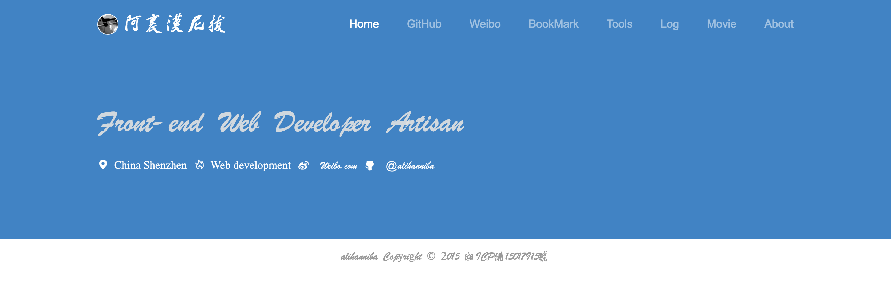

---
* 上述项目仅作个人记录,且不完全!
* 看得上你就拿去,反正不值钱
* nodeJs项目建立在express框架上
* 上述语言暂且浅尝辄止,如有错误敬请[Issue](https://github.com/alihanniba/alihanniba.com-all-languages-version/issues)
* 欢迎大牛指点
* 正式项目技术栈为PHP + Laravel ,项目在我私人项目里,如有需要,Email(alihanniba@gmail.com)我吧

---

###web site

# nodeJs版

# [https://nodejs.alihanniba.com/](https://nodejs.alihanniba.com/)

# PHP版

# [https://www.alihanniba.com/](https://www.alihanniba.com/)

* python版木有上线=_=
* 所有加载模块都没上传,自己动手,丰衣足食
* 原谅我nodeJs站设计是仿的[overtrue大神](http://overtrue.me/)的,侵删.
* 原谅我PHP站设计是仿[掘金](http://gold.xitu.io/#/)与[开发者头条](http://toutiao.io/)的,侵删.
* PHP版陆续在调整后台与前端
* 就这样 

###欢迎指导,乐此不疲!

